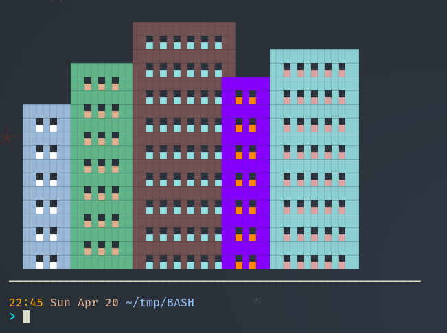

# BASH - only cool stuff!



# 🌆 [ASCII Cityscape Generator](https://github.com/sergey-samoylov/bash_cool_stuff/blob/main/city_skyline.sh)

**Create beautiful terminal-based cityscapes with perfectly aligned buildings using pure Bash!**

This project brings urban landscapes to your terminal with:
- Perfectly symmetrical buildings featuring consistent 2-block walls
- Customizable colors and window patterns
- Realistic city density with naturally overlapping structures
- Smooth ANSI animation effects

## ✨ Features

- 🏙️ **Architectural Precision**: Every building has perfectly aligned 2-block side walls
- 🎨 **Truecolor Support**: 256-color palette with bright/dark variants
- 🌃 **Dynamic Windows**: Automatic window placement with contrast adjustment
- 🏗️ **Smart City Planning**: Buildings connect naturally like real urban landscapes
- ⚡ **Optimized Rendering**: Minimal cursor movement for smooth drawing

## 🚀 Quick Start

```bash
git clone https://github.com/sergey-samoylov/bash_cool_stuff
chmod +x city_skyline.sh
./cityscape.sh
```

## 🖌️ Customization

Easily modify the cityscape by editing the `draw_city` function:

```bash
# Syntax: draw_building <left_col> <width> <height> <color> <window_color>
draw_building 5 12 15 blue bright_white    # Modern glass tower
draw_building 18 8 10 green yellow         # Park-side building
draw_building 25 20 18 red bright_cyan     # Downtown skyscraper
```

## 🌈 Color Palette

Choose from 16 base colors plus extended 256-color options:

| Basic Colors      | Bright Variants     | Special Colors |
|-------------------|---------------------|----------------|
| `black` `red`     | `bright_black` etc. | `orange`       |
| `green` `yellow`  |                     | `purple`       |
| `blue` `magenta`  |                     | `pink`         |
| `cyan` `white`    |                     |                |

## 🏗️ Technical Highlights

- Pure Bash implementation (no external dependencies)
- ANSI escape code abstraction layer
- Responsive design adapts to terminal size
- Careful cursor management prevents artifacts

## 🌟 Inspiration - works by Kris Occhipinti

"Just as the ancient builders crafted cathedrals stone by stone,  
we construct our digital cityscapes block by block  
\- each █ a pixel in our terminal canvas."

## 📜 License

MIT License - Create freely, credit kindly.

---

**Turn your terminal into a vibrant metropolis with just one script!** 🏙️💻
